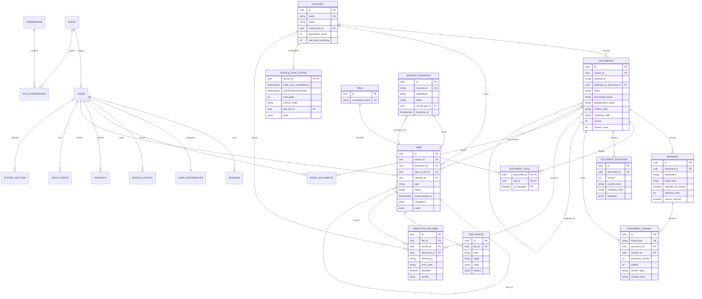
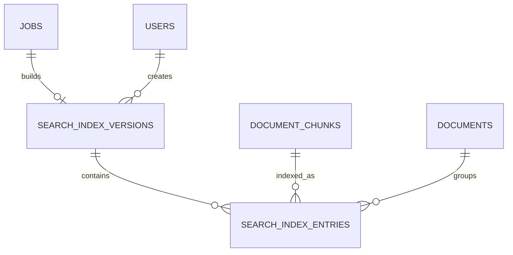

# ER-диаграмма PyAnswer — Этап 4 и подэтап 5.2

`documents ↔ tags` — N:M через `document_tags`; source sync state — 1:1. Duplicate — nullable
self-reference, retry — self-reference job. Revisions и chunks удаляются только вместе с
document. Answers физически сохраняются и reconciliation использует `source_missing`.

Credential/session/API key отсутствуют в ingestion tables, checkpoints, events и failures.
# Дополнение Этапа 6.1

`search_index_versions` хранит version/config/status физической Qdrant collection. `search_index_entries` — идемпотентное соответствие PostgreSQL chunk → Qdrant point; vectors в PostgreSQL не дублируются.
