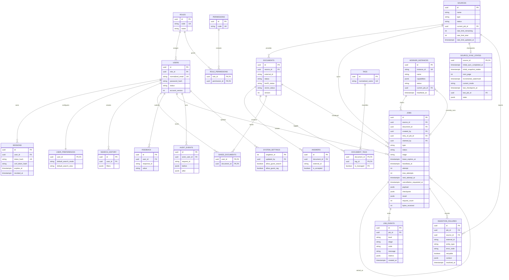

# ER-диаграмма PyAnswer — Этап 4 и подэтап 5.1

`users ↔ permissions` является N:M через role. `documents ↔ tags` — N:M через
`document_tags`. Preferences и source sync state — связи 1:1. History/saved/feedback строго
принадлежат user. Audit является append-only на уровне публичного API.

`jobs.claimed_by` указывает на зарегистрированный worker, а
`worker_instances.current_job_id` отражает его текущую job. Эти ссылки nullable, чтобы stale
recovery и остановка worker не удаляли durable job. `job_events` и `ingestion_failures` не
содержат API key, cookies, tokens или полный ответ Stack Exchange.

Таблицы revisions/chunks и дополнительные processing-поля документов будут добавлены в 5.2;
эта диаграмма не объявляет весь Этап 5 завершённым.
