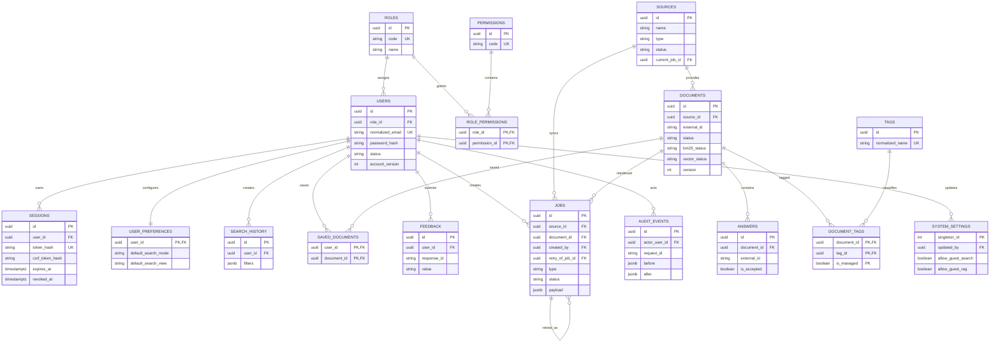

# ER-диаграмма PyAnswer Этапа 4

`users ↔ permissions` является N:M через role. `documents ↔ tags` — N:M через
`document_tags`. Preferences — 1:1. History/saved/feedback строго принадлежат user. Audit является
append-only на уровне публичного API.
